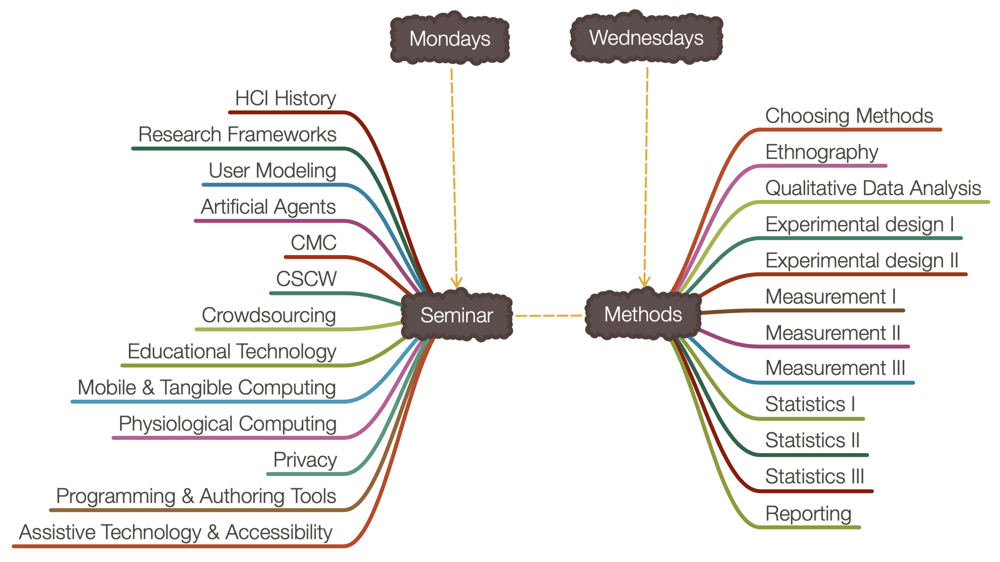

## Welcome to CS-770 Human-Computer Interaction!

This course introduces graduate students in computer science, psychology, educational psychology, and other disciplines research topics, principles, and research methods in human-computer interaction (HCI), *an interdisciplinary area concerned with the study of the interaction between humans and interactive computing systems*. Research in HCI looks at major social, cognitive, and physical phenomena surrounding human use of computers with the goal of understanding their impact and creating guidelines for the design and evaluation of software and physical products and services in industry.

The course consists of three modules: (1) **seminar**, which reviews major research topics in HCI through a set of readings, class presentations, and discussions; (2) **methods**, which covers qualitative and quantitative human-subjects research through lectures, tutorials, hands-on activities, and weekly assignments; and (3) **project**, where students complete a semester-long project, usually involving empirical research, that culminates in the writing of a short paper. Below is a visual overview of the topics that will be covered in the seminar and methods modules.

### Course Resources

<table>
<tr>
	<td>
		<a class="btn btn-blue" href="https://canvas.wisc.edu/courses/192620">Course Canvas Page</a>
	</td>
	<td>
		<a class="btn btn-blue" href="http://piazza.com/wisc/spring2020/cspsychedpsych770/home">Course Piazza Page</a>
	</td>
	<td>
		<a class="btn btn-blue" href="mailto:hci-class@cs.wisc.edu">Contact Instructor/TA</a>
	</td>
	<td>
		<a class="btn btn-blue" href="https://wisconsin-madison.alma.exlibrisgroup.com/view/action/uresolver.do?operation=resolveService&package_service_id=14650690810002122&institutionId=2122&customerId=2120">Course Textbook</a>
	</td>
</tr>
</table>

<table>
<tr>
	<td>
		<a class="label" href="">Course location</a>
	</td>
	<td>
		MW 1:00-2:15 pm, Ed Sciences 228
	</td>
</tr>
<tr>
	<td>
		<a class="label" href="">Instructor office hours</a>
	</td>
	<td>
		MW 2:15-2:45 pm, Ed Sciences 228
	</td>
</tr>
<tr>
	<td>
		<a class="label" href="">TA office hours</a>
	</td>
	<td>
		Tue 4:30-5:30 pm, Thu 1:00-2:00 pm, CS 1308 
	</td>
</tr>
</table>

 

